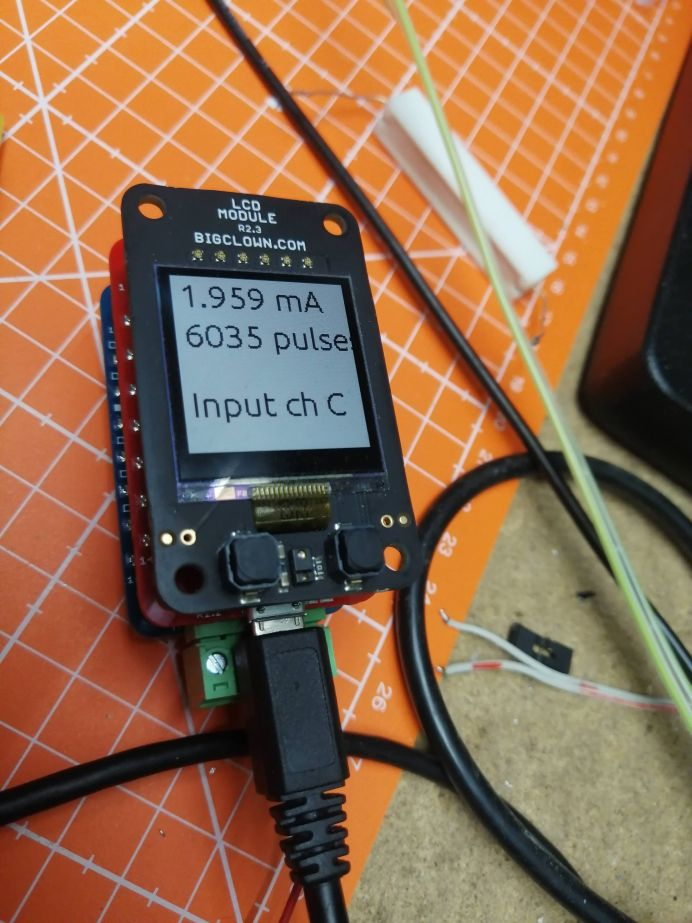

# Firmware for HARDWARIO chester tester

Measuring current from DC/DC pulse counter

- Core Module
- Sensor Module (input C)
- LCD Module (optional)

Sends data over USB. Firmware is not low power.

`# 494.50 <D> pulses: 484, current(A): 0.000139`

## Hardware

The following hardware components are used for this project:

* **[Sensor Module](https://shop.bigclown.com/sensor-module)**
* **[Core Module](https://shop.bigclown.com/core-module)**

## License

This project is licensed under the [MIT License](https://opensource.org/licenses/MIT/) - see the [LICENSE](LICENSE) file for details.

---

Made with &#x2764;&nbsp; by [**HARDWARIO s.r.o.**](https://www.hardwario.com/) in the heart of Europe.
